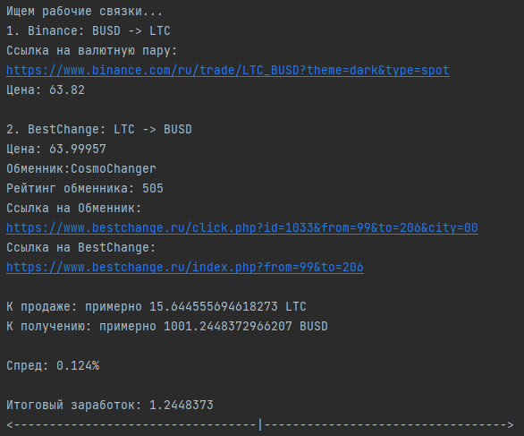

# BestChange - Binance

Скрипт который анализирует сайты BestChange и Binance. 
Скрипт анализирует цены и ищет связки на которых можно заработать на разнице курсов криптовалют имея свободные средства. 
После запуска скрипта надо ввести:
 
1) Желаемую стартовую валюту (USDT - по умолчанию, USDC, BUSD);
2) Стартовый капитал в долларах (например 1000);
3) Минимальное кол-во отзывов обменников (например 200);
4) Через сколько повторять проверки в цикле (например через каждые 10 минут).

Скрипт ищет рабочие связки и выдает в терминал в текстовом виде: 

### Для установки всех зависимостей **"pip install -r requirements.txt"**

PS.В скрипт по желанию можно так же добавить условие выдачи по % СПРЕДА и телеграмм бота, я уже наигрался с ним по этому 
отправляю в свободный доступ на GitHub **^_^** , 

PSS. BestChange Очень не охотно отдает данные с сайта точнее отдает одним zip архивом в 2.5 мб, можно было написать с 
нуля но если есть готовое решение, то зачем изобретать велосипед) использовал часть кода API ( 
https://pypi.org/project/bestchange-api/) переделав и убрав не нужные мне функции. 

"""
